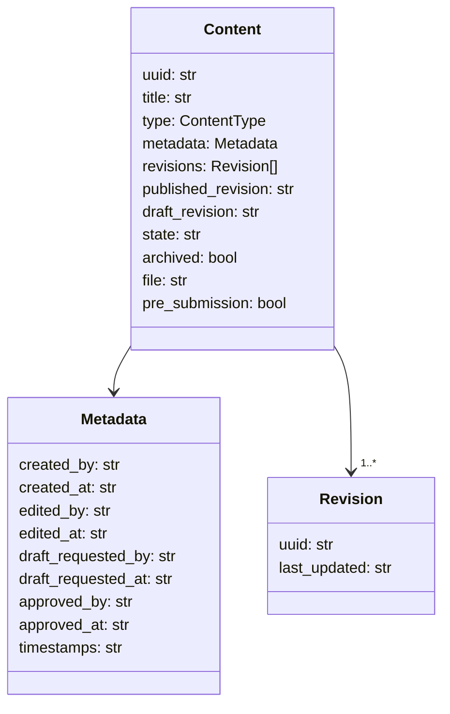
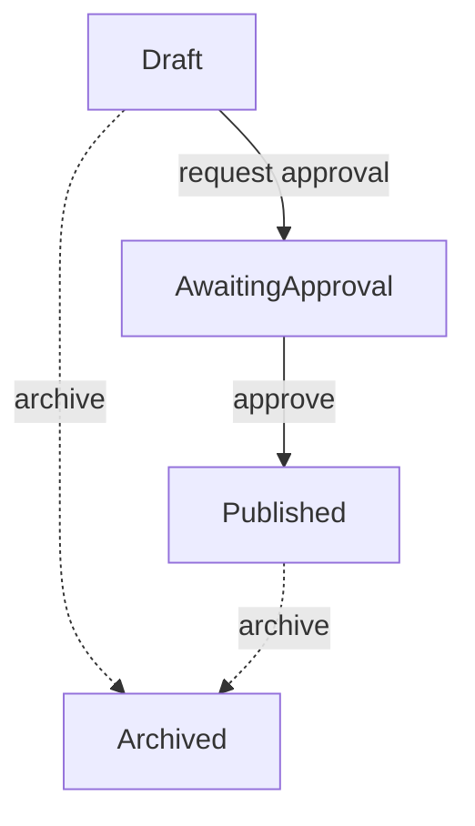

# Data Structure

This document describes the JSON schema used for content items stored by the CMS workflow API.

## Fields

- **uuid** – unique identifier for the content item.
- **title** – human readable title.
- **type** – one of the values from `cms.types.ContentType`.
- **metadata** – object containing audit and workflow metadata. `created_by`, `created_at` and `timestamps` are required when creating new items.
- **revisions** – list of revision objects. Each revision includes a `uuid` and `last_updated` timestamp.
- **published_revision** – UUID of the currently published revision.
- **draft_revision** – UUID of the most recent draft revision.
- **state** – workflow state such as `Draft` or `AwaitingApproval`.
- **archived** – set to `true` if the item is no longer active.
- **file** – base64 encoded file contents (PDF only).
- **pre_submission** – boolean that indicates a newly created PDF has not yet been submitted for approval.

The API will automatically populate revision fields and enforce type validation as demonstrated in the tests.
