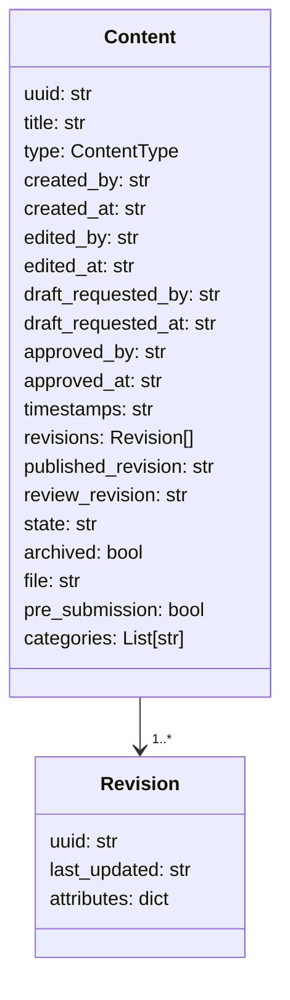
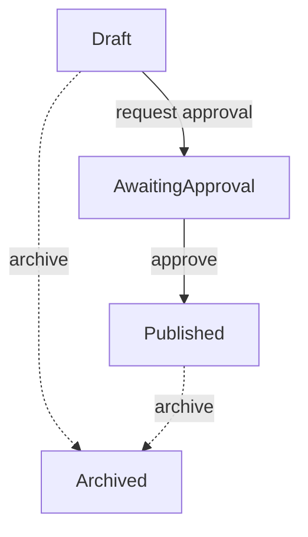

# Data Structure

This document describes the JSON schema used for content items stored by the CMS workflow API.

## Fields

- **uuid** – unique identifier for the content item.
- **title** – human readable title.
- **type** – one of the values from `cms.types.ContentType`.
- **created_by** – user UUID that created the item (required).
- **created_at** – creation timestamp (required).
- **edited_by** – UUID of the user currently editing the item.
- **edited_at** – timestamp of the last edit.
- **draft_requested_by** – UUID of the user that requested approval.
- **draft_requested_at** – when approval was requested.
- **approved_by** – UUID of the approver.
- **approved_at** – timestamp of approval.
- **timestamps** – original creation timestamp (required).
- **revisions** – list of revision objects. Every revision entry contains a `uuid`, a `last_updated` timestamp, and a dictionary of type-specific `attributes` representing the content at that revision.
 - **published_revision** – UUID of the currently published revision.
 - **review_revision** – UUID of the most recent review revision. Both fields
   are ``null`` when content is first created.
- **state** – workflow state such as `Draft` or `AwaitingApproval`. Newly created items always start in the `Draft` state.
- **archived** – set to `true` if the item is no longer active.
- **file** – base64 encoded file contents (PDF only).
- **pre_submission** – boolean that indicates a newly created PDF has not yet been submitted for approval.
- **categories** – list of category UUIDs the content belongs to.

The API will automatically populate revision fields and enforce type validation as demonstrated in the tests.
