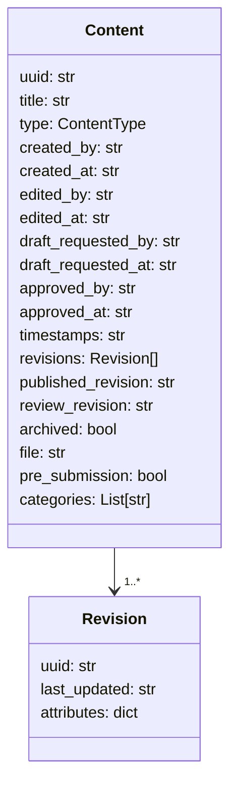

# Data Structure

This document describes the data model used by the CMS workflow API.  While the
HTTP interface exchanges JSON, the implementation stores content as dataclass
objects in a small `DbContext` container.  The following diagrams show the
fields present on those dataclasses as well as the JSON shape returned over the
wire.

## Fields

- **uuid** – unique identifier for the content item.
- **title** – human readable title.
- **type** – one of the values from `cms.types.ContentType`.
- **created_by** – user UUID that created the item (required).
- **created_at** – creation timestamp (required).
- **edited_by** – UUID of the user currently editing the item.
- **edited_at** – timestamp of the last edit.
- **draft_requested_by** – UUID of the user that requested approval.
- **draft_requested_at** – when approval was requested.
- **approved_by** – UUID of the approver.
- **approved_at** – timestamp of approval.
- **timestamps** – original creation timestamp (required).
- **revisions** – list of revision objects. Every revision entry contains a `uuid`, a `last_updated` timestamp, and a dictionary of type-specific `attributes` representing the content at that revision.
 - **published_revision** – UUID of the currently published revision.
 - **review_revision** – UUID of the most recent review revision. Both fields
   are ``null`` when content is first created.
 - **is_published** – boolean computed by the service layer. Set to `true` when
   ``published_revision`` is assigned.
 - **archived** – set to `true` when the content has been removed from active use.
- **file** – base64 encoded file contents (PDF only).
- **pre_submission** – boolean that indicates a newly created PDF has not yet been submitted for approval.
- **categories** – list of category UUIDs the content belongs to.

The API will automatically populate revision fields and enforce type validation as demonstrated in the tests.

## Category Fields

Category objects returned by the API contain:

- **uuid** – unique identifier for the category.
- **name** – display name for the category.
- **display_priority** – integer used to order categories.
- **archived** – set to `true` when the category has been removed from active use.

Categories are **flat**; the API does not currently support parent/child relationships.

### Dataclass Representation

For in‑process operations the code uses dataclass models from
`cms.models`.  The `DbContext` class exposes simple dictionaries mapping
UUIDs to instances of these dataclasses.  When the HTTP layer sends or
receives data, the service layer converts between dataclass objects and
plain dictionaries so that the external JSON structure matches the
schema described above.
